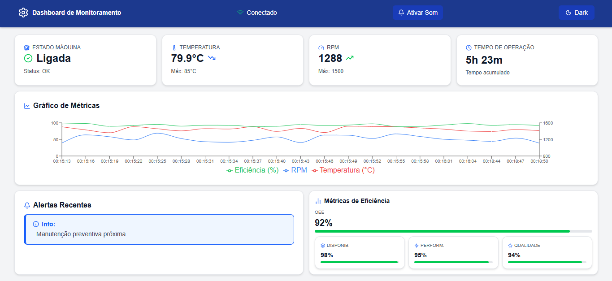

# Dashboard de Automação Industrial

Sistema de monitoramento em tempo real para linha de produção industrial, desenvolvido como desafio técnico Full-stack Junior/Pleno.



---

## 🚀 Stack Tecnológico

- **Framework:** Next.js 16 com App Router
- **Linguagem:** TypeScript (strict mode)
- **Estilização:** Tailwind CSS v4
- **Monorepo:** Turborepo + pnpm workspaces
- **Banco de Dados:** SQLite (better-sqlite3)
- **Gráficos:** Recharts com ComposedChart
- **Ícones:** Lucide React
- **Testes:** Jest + React Testing Library + Cypress E2E
- **Documentação:** Storybook
- **Animações:** tw-animate-css

---

## 📁 Estrutura do Projeto
```
industrial-dashboard/
├── apps/
│   ├── web/                        # Frontend Next.js
│   │   ├── app/
│   │   │   ├── components/
│   │   │   │   ├── cards/
│   │   │   │   │   ├── MachineStateCard.tsx   # Estado da máquina
│   │   │   │   │   ├── TemperatureCard.tsx    # Temperatura
│   │   │   │   │   ├── RPMCard.tsx            # RPM
│   │   │   │   │   ├── UptimeCard.tsx         # Tempo de operação
│   │   │   │   │   └── EfficiencyPanel.tsx    # OEE e métricas
│   │   │   │   ├── charts/
│   │   │   │   │   └── MetricsChart.tsx       # Gráfico de métricas
│   │   │   │   ├── alerts/
│   │   │   │   │   └── AlertsPanel.tsx        # Painel de alertas
│   │   │   │   └── layout/
│   │   │   │       └── Header.tsx             # Cabeçalho
│   │   │   ├── hooks/
│   │   │   │   ├── useMachineData.ts          # Dados em tempo real
│   │   │   │   └── useMetricHistory.ts        # Histórico de métricas
│   │   │   ├── lib/
│   │   │   │   ├── alertsService.ts           # Geração de alertas
│   │   │   │   └── soundService.ts            # Feedback sonoro
│   │   │   ├── stories/                       # Storybook stories
│   │   │   └── types/                         # Re-exportação de tipos
│   │   ├── cypress/
│   │   │   └── e2e/
│   │   │       └── dashboard.cy.ts            # Testes E2E
│   │   └── app/__tests__/                     # Testes Jest
│   └── api/                                   # Backend SQLite
│       └── src/
│           ├── database.ts                    # Configuração do banco
│           ├── seed.ts                        # Dados iniciais
│           └── mockData.ts                    # Gerador de dados
└── packages/
    ├── types/                                 # Interfaces compartilhadas
    │   └── src/index.ts
    └── ui/                                    # Componentes compartilhados
```

---

## ⚙️ Como Instalar

**Pré-requisitos:**
- Node.js 18+
- pnpm
```bash
# Clone o repositório
git clone https://github.com/DouglassenG/industrial_dashboard.git

# Entre na pasta
cd industrial_dashboard

# Instale as dependências
pnpm install
```

---

## ▶️ Como Executar
```bash
# Rodar o projeto em desenvolvimento
pnpm dev
```

Acesse: [http://localhost:3000](http://localhost:3000)

---

## 🧪 Testes
```bash
# Testes unitários com Jest
cd apps/web
npx jest --passWithNoTests

# Testes E2E com Cypress (com o projeto rodando)
cd apps/web
npx cypress open
```

---

## 📖 Storybook
```bash
# Documentação visual dos componentes
cd apps/web
pnpm run storybook
```

Acesse: [http://localhost:6006](http://localhost:6006)

---

## 🏭 Funcionalidades

### Monitoramento em Tempo Real
- Estados da máquina: Ligada, Desligada, Em Manutenção, Erro
- Métricas: Temperatura, RPM, Tempo de Operação, Eficiência
- Atualização automática a cada 3 segundos
- Indicadores de tendência dinâmicos (▲▼) calculados em tempo real
- Indicação visual de perda de conexão

### Visualização de Dados
- Cards de métricas com valores atuais e indicadores de tendência
- Gráfico de histórico com escala dupla — eixo Y esquerdo para Temperatura/Eficiência (0-100) e eixo Y direito para RPM (800-1600)
- Feedback visual quando temperatura ultrapassa o limite máximo
- Interface responsiva para desktop, tablet e mobile

### Sistema de Alertas
- Níveis: INFO, WARNING, CRITICAL
- Priorização automática por severidade e timestamp
- Feedback visual com cores e ícones por nível
- Feedback sonoro para alertas CRITICAL e WARNING (ativado pelo usuário)
- Histórico de alertas

### Métricas de Eficiência Industrial
- OEE (Overall Equipment Effectiveness)
- Disponibilidade (uptime / tempo total)
- Performance (velocidade real vs. teórica)
- Qualidade (produtos bons vs. total)

---

## 🎨 Diferenciais Implementados

- ✅ Dark/Light mode funcional
- ✅ Histórico persistente com localStorage
- ✅ Animações suaves com tw-animate-css
- ✅ Acessibilidade completa (aria-label, role, aria-hidden)
- ✅ Testes E2E com Cypress (8 testes)
- ✅ Documentação visual com Storybook
- ✅ Feedback sonoro para alertas CRITICAL e WARNING
- ✅ Ícones com Lucide React
- ✅ shadcn/ui components

---

## 🏗️ Decisões Técnicas

**Turborepo** — Escolhido pela separação clara de responsabilidades entre frontend e backend, compartilhamento de tipos via `@repo/types` e escalabilidade do monorepo. Permite que `apps/api` e `apps/web` compartilhem as mesmas interfaces TypeScript sem duplicação.

**Tailwind CSS v4** — Versão mais recente com suporte a variáveis CSS nativas via `@theme inline`, configuração simplificada via `@import` e suporte nativo a dark mode com `@custom-variant`.

**SQLite com better-sqlite3** — Solicitado pelo teste para dados mockados. Banco leve, sem necessidade de servidor externo e com dados pré-populados via `seed.ts`.

**Recharts com ComposedChart** — Permite escala dupla no eixo Y, essencial para visualizar simultaneamente temperatura (0-100°C) e RPM (800-1600) sem sobreposição visual.

**Web Audio API** — Escolhida para feedback sonoro por ser nativa do navegador, sem dependências externas. Implementada com `try/catch` para silenciar erros em ambientes sem suporte.

**Hooks customizados** — `useMachineData` centraliza a lógica de geração de dados, cálculo de tendências e controle de conexão. `useMetricHistory` gerencia o histórico com persistência via localStorage.

---

## 📋 Interfaces TypeScript Obrigatórias
```typescript
interface MachineStatus {
  id: string;
  timestamp: Date;
  state: "RUNNING" | "STOPPED" | "MAINTENANCE" | "ERROR";
  metrics: {
    temperature: number;
    rpm: number;
    uptime: number;
    efficiency: number;
  };
  oee: {
    overall: number;
    availability: number;
    performance: number;
    quality: number;
  };
}

interface Alert {
  id: string;
  level: "INFO" | "WARNING" | "CRITICAL";
  message: string;
  component: string;
  timestamp: Date;
  acknowledged: boolean;
}

interface MetricHistory {
  timestamp: Date;
  temperature: number;
  rpm: number;
  efficiency: number;
}
```

---

## 🔗 Links

- **Deploy:** [industrial-dashboard-web.vercel.app](https://industrial-dashboard-web.vercel.app)
- **Repositório:** [github.com/DouglassenG/industrial_dashboard](https://github.com/DouglassenG/industrial_dashboard)

---

## 👤 Autor

Douglas Michel — [GitHub](https://github.com/DouglassenG)
